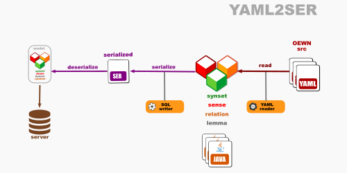
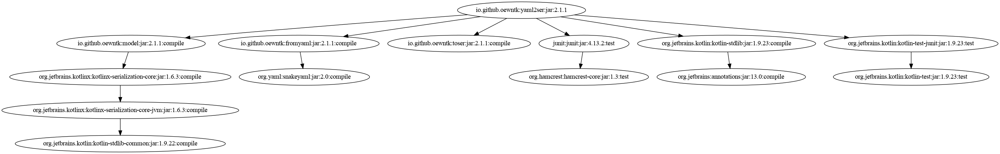

# Open English Wordnet YAML-to-SER grinder

This library reads a model from YAML files and writes it to serialized format.

Project [grind_yaml2ser](https://github.com/oewntk/grind_yaml2ser)

See also [model](https://github.com/oewntk/model/blob/master/README.md).

See also [fromyaml](https://github.com/oewntk/fromyaml/blob/master/README.md).

See also [toser](https://github.com/oewntk/toser/blob/master/README.md).

See also [oewntk](https://github.com/oewntk)
and [globalwordnet/english-wordnet](https://github.com/globalwordnet/english-wordnet).

## Dataflow

This library reads from the OEWN distribution YAML files and other YAML files that contain extra data.

This output conforms to the **serialization** standards.

## Command line

`grind.sh [YAML] [YAML2] [SER]`

grinds the SQL database

*where*

[YAML] directory where OEWN distribution YAML files are

[YAML2] directory where extra YAML files are

[SER] the path to the serialization file

## Maven Central

		<groupId>io.github.oewntk</groupId>
		<artifactId>yaml2ser</artifactId>
		<version>2.1.2</version>

## Dependencies

